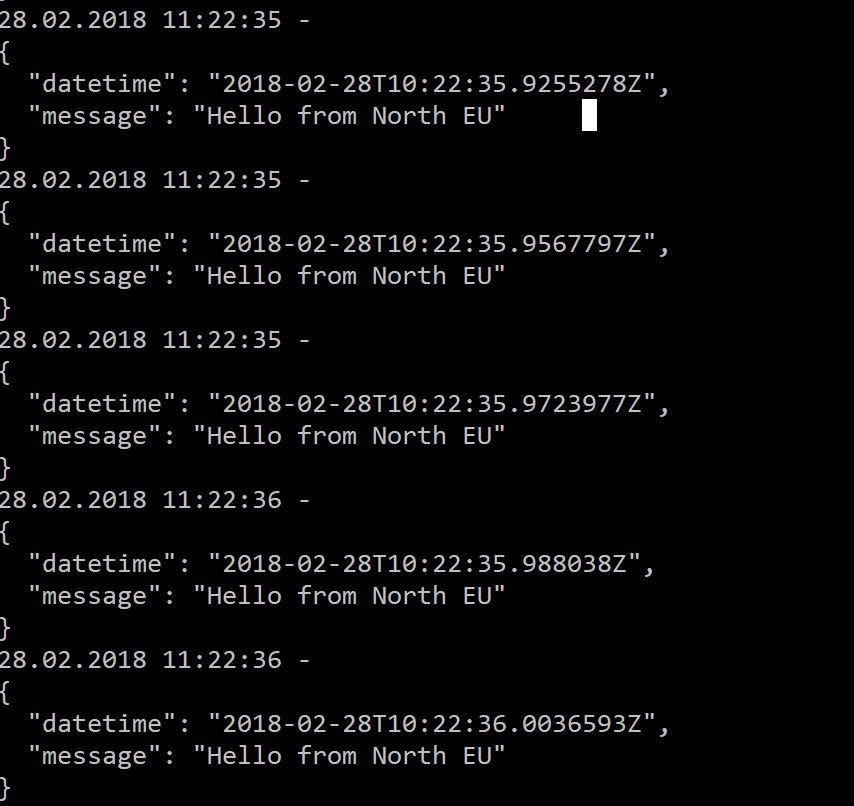

# APIMSwitchEndpoint
This script and C# program were developed as a part of a High Availability solution, in which case you have to switch from one Azure region to another, because one region is not reachable (not very likely, but it's good to have a backup).

The C# program in the VS solution _PingAPIManagement_ just pings the API provided by API Manager with HTTP client request calls - to make the switch visible and to make it possible for you to have a measure of the time interval in which the switch occurs. 

The Powershell Script _switchpolicy.ps1_ performs the switch from one API backend to the other through publishing APIM policies to the API.

## Pre-requisites 

1. You have an exising API Management instance. If not, you can create one [in the portal](https://docs.microsoft.com/en-us/azure/api-management/get-started-create-service-instance) or through ARM. If you just want to test switching APIs, select _Developer_ pricing. When an API Management service is created initially, it contains only one unit and resides in a single Azure region, which is designated as the Primary Region. Additional regions can be easily added through the Azure Portal, which requres _Premium_ pricing. An API Management gateway server is deployed to each region and call traffic will be routed to the closest gateway. If a region goes offline, the traffic is automatically re-directed to the next closest gateway. This makes sense for a production environment. 

2. You have existing APIs to add to API Management. If not, you can create one quite fast by either creating an [API App](https://docs.microsoft.com/en-us/azure/app-service/app-service-web-tutorial-rest-api) in Azure through Visual Studio or [Azure Functions](https://docs.microsoft.com/en-us/azure/azure-functions/functions-create-serverless-api). I created two simple functions with HTTP trigger and practically the same code but a different response, one residing in West and the other in North Europe.  

Integration Settings:


run.cs:
```
#r "Newtonsoft.Json"
using System.Net;

using Newtonsoft.Json;
using System.Text;

public static async Task<HttpResponseMessage> Run(HttpRequestMessage req, TraceWriter log)
{
    log.Info("C# HTTP trigger function processed a request.");


    // Get request body
            dynamic data = await req.Content.ReadAsAsync<object>();
            
            DateTime currentDateTime = DateTime.UtcNow;
            string myMessage = "Hello from West EU";

            var Message = new
                {
                    datetime = currentDateTime,
                    message = myMessage
                };
    var messageString = JsonConvert.SerializeObject(Message, Formatting.Indented);
                
     
    return new HttpResponseMessage(HttpStatusCode.OK) 
    {
        Content = new StringContent(messageString, Encoding.UTF8, "application/json")
    };
}

```

[Generate an API definition](https://docs.microsoft.com/en-us/azure/azure-functions/functions-openapi-definition#generate-the-openapi-definition) for your API in the platform features and edit the definition according to your needs. It can be as simple as this for my _westeu_ API:

```
swagger: '2.0'
info:
  title: westapi.azurewebsites.net
  version: 1.0.0
host: westapi.azurewebsites.net
basePath: /
schemes:
  - https
  - http
paths:
  /api/HttpTriggerCSharp1:
    get:
      operationId: /api/HttpTriggerCSharp1/get
      produces:
        - application/json
      consumes: []
      parameters: []
      description: >-
        Replace with Operation Object
        #http://swagger.io/specification/#operationObject
      responses:
        '200':
          description: Success operation
      security:
        - apikeyQuery: []
    post:
      operationId: /api/HttpTriggerCSharp1/post
      produces:
        - application/json
      consumes: []
      parameters: []
      description: >-
        Replace with Operation Object
        #http://swagger.io/specification/#operationObject
      responses:
        '200':
          description: Success operation
      security:
        - apikeyQuery: []
definitions: {}
securityDefinitions:
  apikeyQuery:
    type: apiKey
    name: code
    in: query

```

3. Add your APIs to API Management. If you have an existing API, you can [add it manually to API Management](https://docs.microsoft.com/en-us/azure/api-management/add-api-manually) or in the case you created a Functions API, here's the documentation on how to [import your Functions API in API Management](https://docs.microsoft.com/en-us/azure/api-management/import-function-app-as-api). Your API backend will get an *ID* which you can use in your policy files for the switch. 

My API in West EU has the following design according to the API definition above:


With the following backend policy (click on the edit icon for _Inbound processing_ and then _</> Code View_):

```
<policies>
    <inbound>
        <base />
        <set-backend-service id="apim-generated-policy" backend-id="FunctionApp_westapi" />
    </inbound>
    <backend>
        <base />
    </backend>
    <outbound>
        <base />
    </outbound>
    <on-error>
        <base />
    </on-error>
</policies>
```

Notice the backend-id for the API. This will be needed at a later stage for the switch policy. Follow the same steps to integrate your other API to API management. 


## Switching between API backends

I decided to create two policy files in my working directory, with the `backend-id` set to the specific API ID I wanted to point to:  
```
        <set-backend-service id="apim-generated-policy" backend-id="[CHANGE THIS TO YOUR BACKEND ID]" />
``` 

You can do a lot more with [API Mananagement policies](https://docs.microsoft.com/en-us/azure/api-management/api-management-policies), but for this specific use case changing the `backend-id` was the only requirement. I could then set the policy with the Powershell command [Set-AzureRmApiManagementPolicy](https://docs.microsoft.com/en-us/powershell/module/azurerm.apimanagement/set-azurermapimanagementpolicy?view=azurermps-5.4.0) in _switchpolicy.ps1_. Ensure that you change the parameters to your specifics in the file:
``` 
# Parameters // Change according to your settings
$ResourceGroupName = 'acf-api-mgmt' # Name of the RG which contains the APIM service
$APIName = 'northeu.azurewebsites.net' # Name of your API
$PolicyFileNameFirst = 'policyfile_west.txt' # Policyfile to switch to or from
$PolicyFileNameSecond = 'policyfile_north.txt' # Policyfile to switch to or from
$PSScriptRoot = "C:\Users\smanalo\Source\Repos\PingAPIMgmt\" # Working directory, make sure your files are in this one
``` 

It prompts you for a _first_ or _second_ choice, which in my case were the files for West and North EU, respectively. 

```  
#Prompt for switch 
$whereto = ''
$whereto = Read-Host -Prompt 'Switch to this API (first,second)'
Write-Host "You chose" $whereto
```  

This part gets the context of API Management, reads the policy file, and sets it to your choice:

``` 
# Get context and set URL
$ApiMgmtObj = Get-AzureRmApiManagement -ResourceGroupName $ResourceGroupName
$ApimUrl = $ApiMgmtObj.RuntimeUrl
$ApimService = $ApiMgmtObj.Name

$ApiMgmtContext = New-AzureRmApiManagementContext -ResourceGroupName $ResourceGroupName -ServiceName $ApimService
$switchapi = Get-AzureRmApiManagementApi -Context $ApiMgmtContext -Name $APIName

# Read Policy File
if ($whereto -eq 'first') {$PolicyFileName = $PolicyFileNameFirst; 
        Write-Host "Please wait, switching to First API"; }
    elseif ($whereto -eq 'second') {$PolicyFileName = $PolicyFileNameSecond; 
        Write-Host "Please wait, switching to Second API"; }
    else { Write-Host "You did not enter a valid option"; 
       exit; }


$PolicyFile = [System.IO.Path]::GetFullPath([System.IO.Path]::Combine($PSScriptRoot, $PolicyFileName))
``` 

Finally, the API policy is set and you get an output of the actual policy for the API.

```  
Set-AzureRmApiManagementPolicy -Context $ApiMgmtContext -ApiId $switchapi.ApiId -PolicyFile $PolicyFile

$Policy = Get-AzureRmApiManagementPolicy -Context $ApiMgmtContext -ApiId $switchapi.ApiId

Write-Host "Current policy is: " $Policy
``` 
## PingAPIManagement
The console program PingAPIManagement makes a WebClient call to your frontend API endpoint of API Management and returns the message from the API. To authenticate, your `Ocp-Apim-Subscription-Key` should be a part of the header. Edit these two lines and you are good to go:

``` 
                client.Headers.Add("Ocp-Apim-Subscription-Key:[ENTER YOUR KEY HERE]");
                var result = client.DownloadString("[ENTER YOUR API URI HERE]"); //URI  
``` 

This is the simple output of PingAPIManagement from my API

